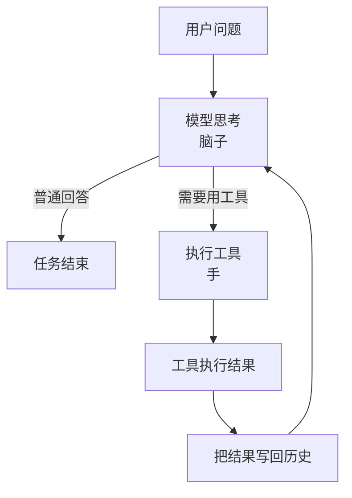

>本文是对[learn-claude-code](https://github.com/shareAI-lab/learn-claude-code)的学习笔记，主要记录在现代 agent 设计过程中的思考与实践，以及我自己在项目中遇到的问题与思考。
> 原文很多表述和观点过于傲慢与主观，此处想用一个更加贴合大众视角的角度，对原文进行重构与分析，仅供参考批评。

## 模型是脑子，工程是手

MIT 的校训是 Mens et Manus —— 心智与双手。
现在几乎所有大模型公司都在全力让“脑子”变得更聪明：更大的模型、更强的推理、更长的上下文。但再聪明的脑子，如果没有一双能真正干活的手，它依然什么都做不了。
我们现在要做的，就是给这个已经很聪明的脑子，配上一双真正能用的手。

不管是 Anthropic 还是 OpenAI 的 SDK，或者说它们的 API 规范，核心其实都只有两样东西：

1. Messages 的组装：这对应的是上下文（Context）
2. Tools 的传入：这对应的是工具（Tools）

这两样东西，分别对应了 Agent 最核心的两个环节：

* 如何定义上下文（大脑该知道什么、不该知道什么）
* 如何设计工具（手该做什么、怎么做才可靠）

所有真正能落地的 Agent 系统，本质上都是在这两个方向上不断打磨。

上下文定义得好，大脑才能想清楚；

工具设计得好，手才能真正把事干成。

## 最小的 Agent 循环

### 这一章要解决什么问题

语言模型本身只会“生成下一段文字”。

它不会自己：打开文件、运行命令、看到报错、把执行结果拿来继续思考

如果没有一层代码在中间反复做这件事：

发请求给模型 -> 模型说要用工具 -> 真的去执行工具 -> 把结果再喂回模型 -> 继续下一轮

那模型就只是一个会说话的程序，还不是一个会干活的 Agent。

所以这一章的核心目标就是把“模型 + 工具”连接成一个能持续推进任务的主循环。

### 最简单的流程

下面是这个过程的完整回路：



**最关键的一点**：  
工具执行完的结果，必须重新回到模型那里，让它能看到真实世界发生了什么。

### 最小代码实现

我们一步一步来做。

**第一步**：把用户的问题放进消息列表
```python
messages = [{"role": "user", "content": query}]
```

**第二步**：把消息发给模型
```python
response = client.messages.create(
    model=MODEL,
    system=SYSTEM,
    messages=messages,
    tools=TOOLS,
)
```

**第三步**：把模型的回复记下来

```python
messages.append({"role": "assistant", "content": response.content})
```

**第四步**：如果模型想用工具，就真的执行
```python
if response.stop_reason == "tool_use":
    for block in response.content:
        if block.type == "tool_use":
            result = run_tool(block)    # 真正执行工具
            # 把结果包装好
            tool_result = {
                "type": "tool_result",
                "tool_use_id": block.id,
                "content": result
            }
            messages.append({"role": "user", "content": [tool_result]})
```

**第五步**：回到第二步，继续下一轮

### 组合成完整的最小循环

```python
def agent_loop(messages):
    while True:
        response = client.messages.create(
            model=MODEL,
            system=SYSTEM,
            messages=messages,
            tools=TOOLS,
        )

        messages.append({"role": "assistant", "content": response.content})

        if response.stop_reason != "tool_use":
            return

        results = []
        for block in response.content:
            if block.type == "tool_use":
                output = run_tool(block)
                results.append({
                    "type": "tool_result",
                    "tool_use_id": block.id,
                    "content": output,
                })

        messages.append({"role": "user", "content": results})
```

这就是最小的 Agent Loop。

所以这一章最重要的一句话是：

**Agent 的核心，不是模型有多聪明，而是系统能持续把真实执行结果喂回模型。**
