>本文是对[learn-claude-code](https://github.com/shareAI-lab/learn-claude-code)的学习笔记，主要记录在现代 agent 设计过程中的思考与实践，以及我自己在项目中遇到的问题与思考。
> 原文很多表述和观点过于傲慢与主观，此处想用一个更加贴合大众视角的角度，对原文进行重构与分析，仅供参考批评。

## 模型是脑子，工程是手

MIT 的校训是 Mens et Manus —— 心智与双手。
现在几乎所有大模型公司都在全力让“脑子”变得更聪明：更大的模型、更强的推理、更长的上下文。但再聪明的脑子，如果没有一双能真正干活的手，它依然什么都做不了。
我们现在要做的，就是给这个已经很聪明的脑子，配上一双真正能用的手。

不管是 Anthropic 还是 OpenAI 的 SDK，或者说它们的 API 规范，核心其实都只有两样东西：

1. Messages 的组装：这对应的是上下文（Context）
2. Tools 的传入：这对应的是工具（Tools）

这两样东西，分别对应了 Agent 最核心的两个环节：

* 如何定义上下文（大脑该知道什么、不该知道什么）
* 如何设计工具（手该做什么、怎么做才可靠）

所有真正能落地的 Agent 系统，本质上都是在这两个方向上不断打磨。

上下文定义得好，大脑才能想清楚；

工具设计得好，手才能真正把事干成。

## 最小的 Agent 循环

### 这一章要解决什么问题

语言模型本身只会“生成下一段文字”。

它不会自己：打开文件、运行命令、看到报错、把执行结果拿来继续思考

如果没有一层代码在中间反复做这件事：

发请求给模型 -> 模型说要用工具 -> 真的去执行工具 -> 把结果再喂回模型 -> 继续下一轮

那模型就只是一个会说话的程序，还不是一个会干活的 Agent。

所以这一章的核心目标就是把“模型 + 工具”连接成一个能持续推进任务的主循环。

### 最简单的流程

下面是这个过程的完整回路：

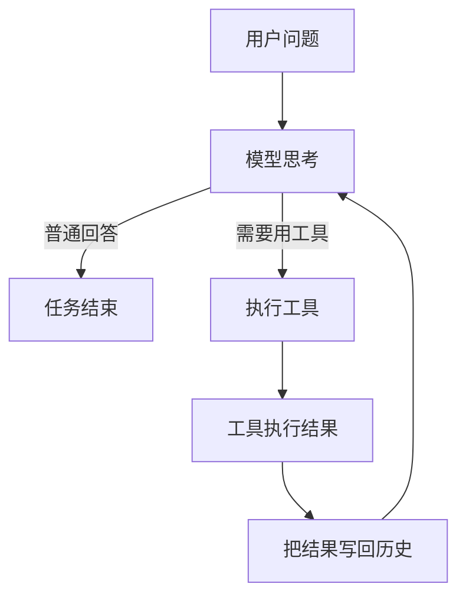

**最关键的一点**：  
工具执行完的结果，必须重新回到模型那里，让它能看到真实世界发生了什么。

### 最小代码实现

我们一步一步来做。

**第一步**：把用户的问题放进消息列表
```python
messages = [{"role": "user", "content": query}]
```

**第二步**：把消息发给模型
```python
response = client.messages.create(
    model=MODEL,
    system=SYSTEM,
    messages=messages,
    tools=TOOLS,
)
```

**第三步**：把模型的回复记下来

```python
messages.append({"role": "assistant", "content": response.content})
```

**第四步**：如果模型想用工具，就真的执行
```python
if response.stop_reason == "tool_use":
    for block in response.content:
        if block.type == "tool_use":
            result = run_tool(block)    # 真正执行工具
            # 把结果包装好
            tool_result = {
                "type": "tool_result",
                "tool_use_id": block.id,
                "content": result
            }
            messages.append({"role": "user", "content": [tool_result]})
```

**第五步**：回到第二步，继续下一轮

### 组合成完整的最小循环

```python
def agent_loop(messages):
    while True:
        response = client.messages.create(
            model=MODEL,
            system=SYSTEM,
            messages=messages,
            tools=TOOLS,
        )

        messages.append({"role": "assistant", "content": response.content})

        if response.stop_reason != "tool_use":
            return

        results = []
        for block in response.content:
            if block.type == "tool_use":
                output = run_tool(block)
                results.append({
                    "type": "tool_result",
                    "tool_use_id": block.id,
                    "content": output,
                })

        messages.append({"role": "user", "content": results})
```

这就是最小的 Agent Loop。

所以这一章最重要的一句话是：

**Agent 的核心，不是模型有多聪明，而是系统能持续把真实执行结果喂回模型。**

## 加一个工具，只加一个 handler

**循环不用动，新工具注册进去就行。**

这一章我们继续给大脑配手：  
学会**如何轻松增加新工具**，同时保持主循环完全不变。


### 为什么这一步很重要？

在上一小节里，我们只有 `bash` 一个工具。所有操作都走终端。

但真实工作中，只靠 bash 很快就会遇到问题：

- `cat` 有时候输出太多被截断
- `sed` 碰到特殊字符就容易出错
- 直接跑 shell 命令，安全性很难控制

我们需要更专用的工具，比如：

- `read_file`：安全地读取文件内容
- `write_file`：安全地写入文件
- `edit_file`：精准修改文件某一部分

我们只需要给“手”多准备几套动作，然后告诉大脑这些动作叫什么名字。

### 最简单的思路

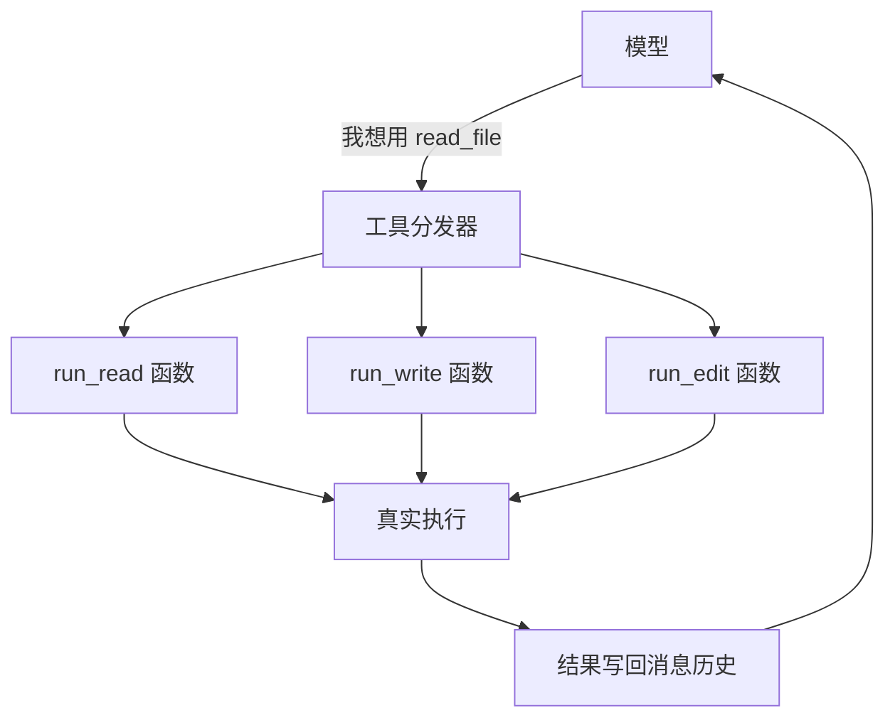

大脑只管说“我要用哪个工具”，  
工程层（手）负责把名字翻译成真正的函数去执行。


### 怎么实现？

#### 写每个工具的实际执行函数

```python
def safe_path(p: str) -> Path:
    """防止路径跑到工作目录外面"""
    path = (WORKDIR / p).resolve()
    if not path.is_relative_to(WORKDIR):
        raise ValueError(f"路径超出允许范围: {p}")
    return path

def run_read(path: str, limit: int = None):
    text = safe_path(path).read_text()
    if limit:
        text = "\n".join(text.splitlines()[:limit])
    return text[:50000]   # 防止输出过长
```

同理可以写 `run_write`、`run_edit` 等。

#### 做一个工具分发字典

```python
TOOL_HANDLERS = {
    "bash":       lambda **kw: run_bash(kw["command"]),
    "read_file":  lambda **kw: run_read(kw["path"], kw.get("limit")),
    "write_file": lambda **kw: run_write(kw["path"], kw["content"]),
    "edit_file":  lambda **kw: run_edit(kw["path"], kw["old_text"], kw["new_text"]),
}
```

这就是核心：**一个字典，把工具名字映射到对应的函数**。

#### 在循环里使用分发器（循环本身几乎不变）

```python
results = []
for block in response.content:
    if block.type == "tool_use":
        handler = TOOL_HANDLERS.get(block.name)
        if handler:
            output = handler(**block.input)
        else:
            output = f"未知工具: {block.name}"
        
        results.append({
            "type": "tool_result",
            "tool_use_id": block.id,
            "content": output,
        })
```

**加一个新工具 = 两件事：**
1. 写一个 `run_xxx` 函数
2. 在 `TOOL_HANDLERS` 里注册一行

主循环完全不用改。

## 会话里的计划

**计划不是替模型思考，而是把“正在做什么”明确写出来。**

这一章我们给大脑加一个**当前工作面板**，让它在大任务中不容易忘事或跑偏。

### 为什么需要这一步？

在上一节中 Agent 已经能读文件、写文件、跑命令了。

但当任务变成多步的时候，很快就会出现问题：

- 做着做着就忘了最初的目标
- 已经检查过的东西又重复做一遍
- 一开始列了很多步骤，后面又开始即兴发挥

**原因很简单**：模型虽然很聪明，但它的注意力很容易受当前上下文影响。

我们需要把**当前计划**从模型的脑子里“拿出来”，变成系统里一块看得见、能持续更新的面板。


### 最简单的心智模型

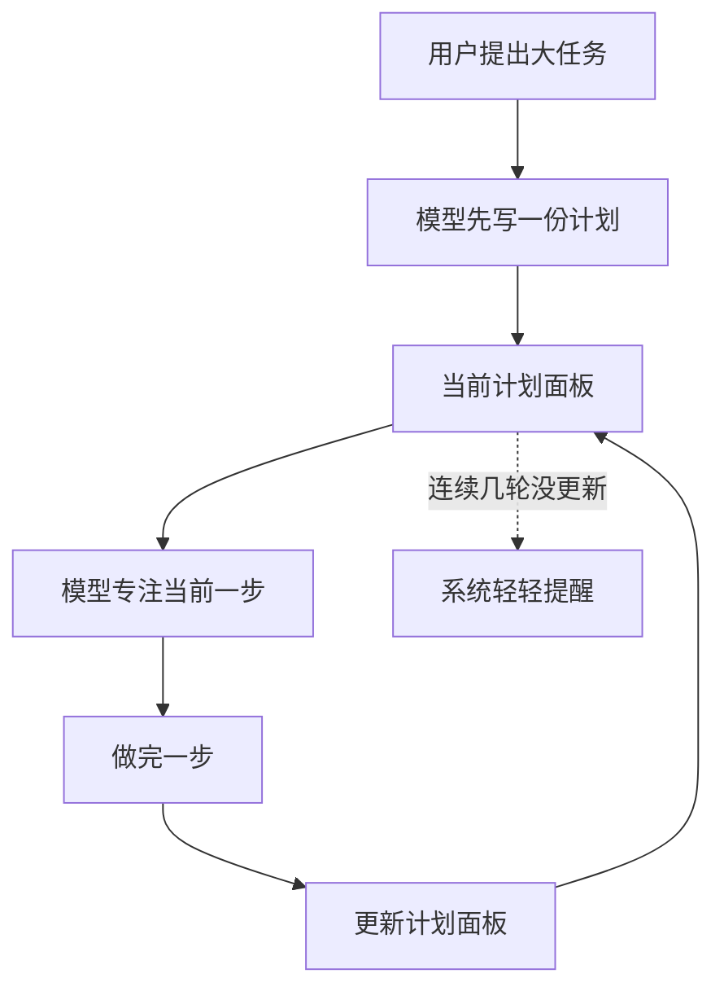

计划不是一次性写完就扔掉，而是**边做边更新**的活面板。

### 怎么实现？

#### 准备一个计划管理器（TodoManager）

```python
class TodoManager:
    def __init__(self):
        self.items = []          # 当前计划列表
        self.rounds_since_update = 0   # 多少轮没更新计划了
```

#### 让模型可以整份更新计划

```python
def update(self, items: list) -> str:
    # 验证并保存新计划
    # 同一时间只允许一个步骤是 "正在做"
    self.items = normalized_items
    self.rounds_since_update = 0
    return self.render()   # 返回可读的计划文本
```

#### 把计划渲染成清晰的文本

```python
def render(self) -> str:
    lines = []
    for item in self.items:
        if item.status == "pending":
            marker = "[ ]"
        elif item.status == "in_progress":
            marker = "[>]"
        else:
            marker = "[x]"
        lines.append(f"{marker} {item.content}")
    return "\n".join(lines)
```

#### 把 todo 注册成一个普通工具

```python
TOOL_HANDLERS = {
    "bash":       ...,
    "read_file":  ...,
    "write_file": ...,
    "edit_file":  ...,
    "todo":       lambda **kw: TODO.update(kw["items"]),   # 新增
}
```

**注意**：循环本身完全不需要改，和 s02 一样。

### 加上温和的提醒机制

```python
if not used_todo:   # 这轮没更新计划
    TODO.rounds_since_update += 1
    if TODO.rounds_since_update >= 3:
        results.insert(0, {"type": "text", "text": "<reminder>请刷新一下当前计划</reminder>"})
```

### 它如何接进主循环？

从这一章开始，主循环除了维护 `messages`，还多维护了一份**会话计划状态**：

- `messages` ：模型看到的历史对话
- `planning state` ：当前正在做的计划面板（外显、可更新）

这样，模型不再只靠脑子记计划，而是有一个外部的“白板”可以反复查看和修改。

## 子智能体（Subagent）

**一个大任务，不一定要塞进同一个上下文里做完。**

这一章我们给大脑**增加上下文隔离的能力**：把局部任务交给一个“干净的小脑子”去做，做完只把结果带回来。

### 为什么需要子智能体？

当 Agent 连续做很多事情时，`messages` 会变得越来越长、越来越乱。

比如用户只是问了一句：

> “这个项目用什么测试框架？”

Agent 可能为了回答这个问题，读了很多文件、跑了很多命令。这些中间过程如果全部堆在主对话里，后面的问题就会被大量“噪声”淹没。

**子智能体要解决的核心问题就是：**

把局部任务放到**独立干净的上下文**里执行，做完只带回必要的总结。

### 最简单的心智模型

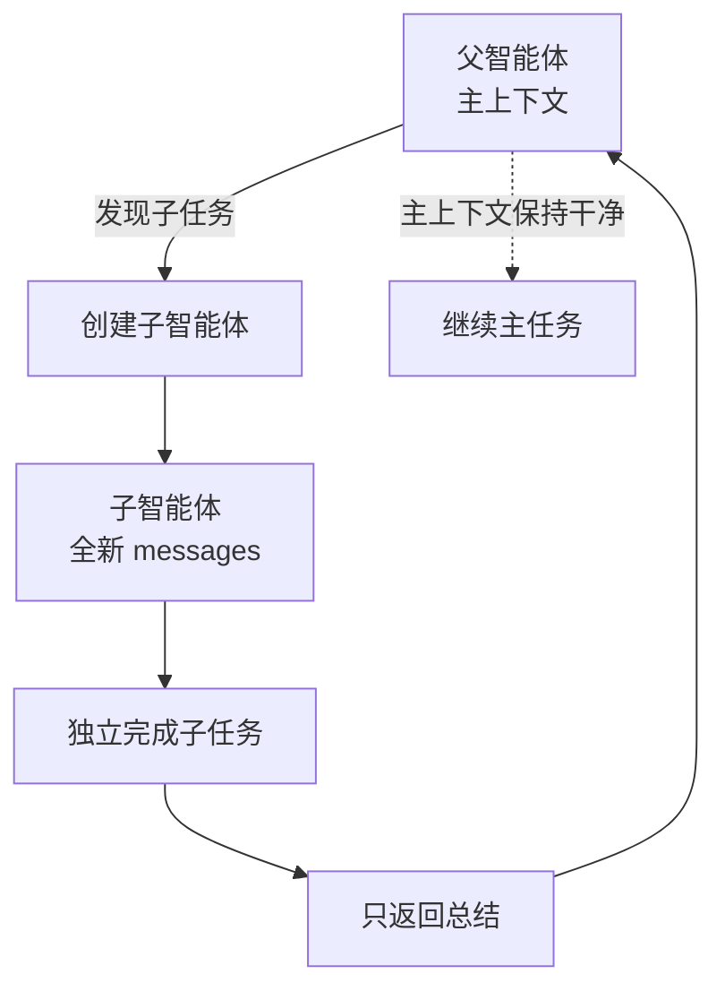

**关键点**：子智能体的中间过程**不会污染**父智能体的上下文。

### 子智能体是如何实现的？（结合代码讲解）

#### 父智能体增加一个 `task` 工具

这是父智能体用来“派活”的工具：

```python
PARENT_TOOLS = [
    ... # 其他工具
    {
        "name": "task",
        "description": "Spawn a subagent with fresh context...",
        "input_schema": {
            "properties": {
                "prompt": {"type": "string"},
                "description": {"type": "string"}
            }
        }
    }
]
```

模型可以在任何时候调用 `task`，把一个子任务描述传进去。

### 子智能体使用全新的上下文

这是实现**隔离**的最核心代码：

```python
def run_subagent(prompt: str) -> str:
    sub_messages = [{"role": "user", "content": prompt}]    # 全新上下文！
    
    for _ in range(30): # 安全上限，防止无限循环
        response = client.messages.create(
            model=MODEL,
            system=SUBAGENT_SYSTEM,
            messages=sub_messages,  # 使用自己的消息列表
            tools=CHILD_TOOLS,  # 使用受限工具集
        )
        
        sub_messages.append({"role": "assistant", "content": response.content})
        
        if response.stop_reason != "tool_use":
            break
            
        # 执行工具（和主循环一样）
        results = []
        for block in response.content:
            if block.type == "tool_use":
                handler = TOOL_HANDLERS.get(block.name)
                output = handler(**block.input) if handler else ...
                results.append({...})
        
        sub_messages.append({"role": "user", "content": results})
    
    # 只返回最后一段文字总结
    return "".join(b.text for b in response.content if hasattr(b, "text")) or "(no summary)"
```

**注意**：
- 子智能体**不共享**父智能体的 `messages`
- 子智能体**工具更少**（`CHILD_TOOLS`），没有 `task` 工具，防止无限递归
- 最后只返回总结，不把整个过程塞回父上下文

### 在主循环中处理 `task` 工具

```python
if block.name == "task":
    prompt = block.input.get("prompt", "")
    output = run_subagent(prompt)   # 启动子智能体
    results.append({
        "type": "tool_result",
        "tool_use_id": block.id,
        "content": output
    })
```

## 技能系统（按需加载）

**不是把所有知识永远塞进 prompt，而是在需要的时候再加载正确那一份。**

这一章我们给大脑增加**按需知识加载**的能力：平时只告诉它有哪些技能可用，真正需要时才把完整内容拿进来。

### 为什么需要这一步？

到上一节 Agent 已经能用工具、做计划、拆子任务了。

但不同任务需要的**专业知识**差别很大：

- 做代码审查：需要审查清单
- 做 Git 操作：需要提交规范
- 做 MCP 集成：需要专门流程

如果你把所有这些知识一股脑塞进 `system prompt`，会出现两个问题：

1. 大量 token 被当前用不到的内容占用
2. 主规则越来越模糊，prompt 越来越臃肿

**这一节的解决方案**：把“可选的专业知识”从常驻 prompt 里拆出来，改成**先轻发现、再按需深加载**。


### 最简单的心智模型

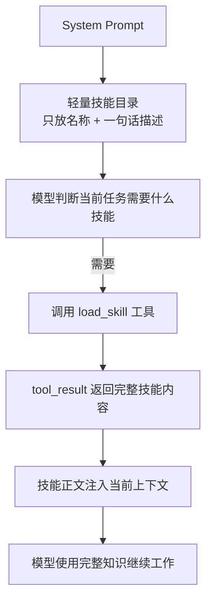

平时只看“菜单”，需要时才点“菜”。

### 怎么实现？

#### 建立技能仓库（SkillRegistry）

```python
SKILLS_DIR = WORKDIR / "skills"

class SkillRegistry:
    def __init__(self, skills_dir: Path):
        self.documents = {}
        self._load_all()

    def _load_all(self):
        for path in skills_dir.rglob("SKILL.md"):
            meta, body = self._parse_frontmatter(path.read_text())
            name = meta.get("name", path.parent.name)
            self.documents[name] = SkillDocument(
                manifest=SkillManifest(name=name, description=meta.get("description", "")),
                body=body
            )
```

每个技能放在 `skills/xxx/SKILL.md`，文件开头可以写简单的 frontmatter（元信息）。

#### 把「技能目录」放进 system prompt（轻量）

```python
SYSTEM = f"""You are a coding agent at {WORKDIR}.
Use load_skill when you need specialized guidance.

Skills available:
{SKILL_REGISTRY.describe_available()}
"""
```

`describe_available()` 只返回类似下面这样的轻量信息：

```
- code-review: 代码审查清单和最佳实践
- git-workflow: 分支管理和提交规范
- mcp-builder: 构建 MCP Server 的步骤
```

#### 提供 load_skill 工具（按需加载）

```python
TOOL_HANDLERS = {
    ...
    "load_skill": lambda **kw: SKILL_REGISTRY.load_full_text(kw["name"]),
}
```

工具实现：

```python
def load_full_text(self, name: str) -> str:
    document = self.documents.get(name)
    if not document:
        return f"Error: Unknown skill '{name}'"
    
    return f"""<skill name="{document.manifest.name}">
{document.body}
</skill>"""
```

模型调用 `load_skill` 后，完整内容会通过 `tool_result` 进入当前上下文。

#### 在主循环中使用（和之前完全一样）

```python
if block.name == "load_skill":
    output = SKILL_REGISTRY.load_full_text(block.input["name"])
    # 结果自然地作为 tool_result 写回 messages
```

## 上下文压缩

**保持活跃上下文小而稳。**

这一章我们给大脑增加**上下文管理**的能力：当对话越来越长时，把不必要的细节搬走，只留下继续工作真正需要的信息。


### 为什么需要这一步？

到上一节， Agent 已经能读写文件、做计划、派子智能体、按需加载技能了。

但它做得越多，`messages` 就膨胀得越快：

- 读一个大文件：塞进一大段文本
- 跑一条长命令：返回很长的输出
- 多轮任务推进：旧结果越堆越多

如果不做任何处理，很快就会出现：

1. 模型注意力被旧内容淹没
2. API 请求越来越贵、越来越慢
3. 最终撞上上下文上限，整个任务被迫中断

**这一章要解决的问题就是**：在不丢失工作连续性的前提下，把活跃上下文重新腾出空间。


### 最简单的心智模型

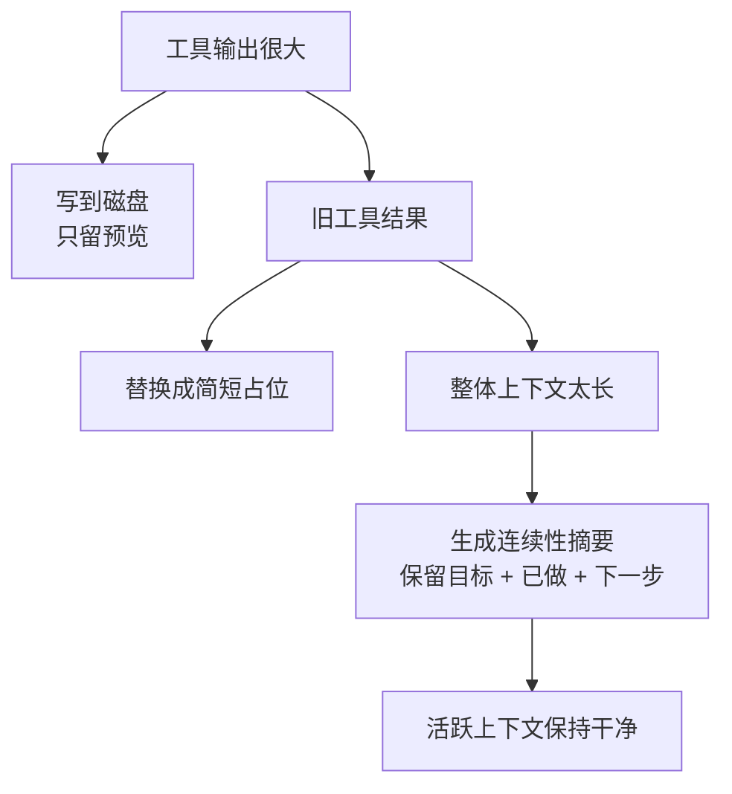

压缩不是“删历史”，而是**把细节搬走，让大脑继续专注**。


### 怎么实现？

#### 大工具输出先写到磁盘（避免塞满上下文）

```python
def persist_large_output(tool_use_id: str, output: str) -> str:
    if len(output) <= PERSIST_THRESHOLD:    # 默认 30000 字符
        return output
    
    # 存到磁盘
    TOOL_RESULTS_DIR.mkdir(parents=True, exist_ok=True)
    path = TOOL_RESULTS_DIR / f"{tool_use_id}.txt"
    path.write_text(output)
    
    preview = output[:PREVIEW_CHARS]    # 只留前 2000 字符
    return f"""<persisted-output>
Full output saved to: {path.relative_to(WORKDIR)}
Preview:
{preview}
</persisted-output>"""
```

`run_bash` 和 `run_read` 现在都会调用这个函数。

#### 旧工具结果做微压缩（micro compact）

```python
def micro_compact(messages: list) -> list:
    # 只保留最近 3 个工具结果的完整内容
    tool_results = collect_tool_result_blocks(messages)
    for old_result in tool_results[:-KEEP_RECENT_TOOL_RESULTS]:
        old_result["content"] = "[Earlier tool result compacted. Re-run the tool if you need full detail.]"
    return messages
```

这一步在每次调用模型前自动执行，防止旧结果一直占用空间。

#### 整体上下文太长时，做完整压缩

```python
def compact_history(messages: list, state: CompactState) -> list:
    # 先把完整历史存成 transcript（便于以后恢复）
    transcript_path = write_transcript(messages)
    
    # 让模型生成一份连续性摘要
    summary = summarize_history(messages)
    
    # 返回新的精简消息
    return [{
        "role": "user",
        "content": f"""This conversation was compacted so the agent can continue working.

{summary}"""
    }]
```

摘要会尽量保留：
- 当前目标
- 重要发现和决定
- 读过/改过的文件
- 还没完成的工作

### 在主循环里接入压缩（自动 + 手动）

```python
def agent_loop(messages: list, state: CompactState):
    while True:
        messages[:] = micro_compact(messages)   # 微压缩
        
        if estimate_context_size(messages) > CONTEXT_LIMIT: # 自动压缩
            messages[:] = compact_history(messages, state)
        
        response = client.messages.create(...)
        
        # 如果模型主动调用 compact 工具，就触发手动压缩
        if manual_compact:
            messages[:] = compact_history(messages, state, focus=compact_focus)
```

## 权限与安全

**模型可以提出行动建议，但真正执行之前，必须先过安全关。**

这一章我们给“手”加一道**权限闸门**：把模型的意图和实际执行拆开，中间插入清晰的检查流程。

### 为什么需要这一步？

到了上一节 Agent 已经拥有很强的执行能力（读写文件、跑命令、子智能体、技能加载、上下文压缩）。

能力越强，越容易出问题：

- 一不小心写错重要文件
- 执行危险的 shell 命令
- 在不该修改的时候动手

**这一章的核心目标是**：建立一条**权限管道**，让任何工具调用都必须先过检查，再决定是执行、询问用户，还是直接拒绝。

### 最简单的心智模型

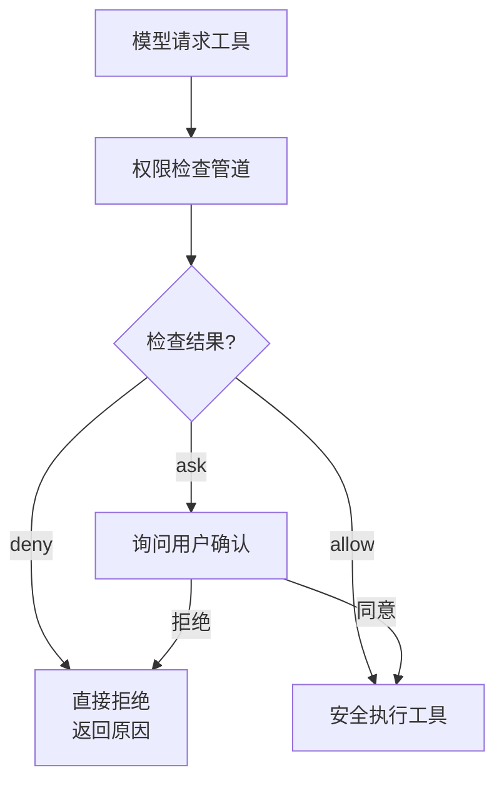

**关键思想**：意图 ≠ 执行，中间必须经过一道明确的管道。

---

### 怎么实现？

#### 三种基础权限模式

```python
MODES = ("default", "plan", "auto")
```

- **default**：大多数操作需要用户确认（最常用）
- **plan**：只允许读操作，禁止任何修改（适合审查代码）
- **auto**：安全读操作自动通过，写操作仍需确认（追求流畅度）

### 权限检查主管道（PermissionManager）

```python
def check(self, tool_name: str, tool_input: dict) -> dict:
    # Step 0: Bash 安全校验（最危险的工具单独处理）
    if tool_name == "bash":
        failures = bash_validator.validate(tool_input.get("command", ""))
        if severe_failures:
            return {"behavior": "deny", "reason": "严重危险命令"}
        if failures:
            return {"behavior": "ask", "reason": "Bash 有风险，需要确认"}
    
    # Step 1: 拒绝规则（最高优先级）
    for rule in self.rules:
        if rule["behavior"] == "deny" and self._matches(rule, tool_name, tool_input):
            return {"behavior": "deny", ...}
    
    # Step 2: 根据当前模式快速决策
    if self.mode == "plan" and tool_name in WRITE_TOOLS:
        return {"behavior": "deny", "reason": "plan 模式禁止修改"}
    
    if self.mode == "auto" and tool_name in READ_ONLY_TOOLS:
        return {"behavior": "allow", "reason": "auto 模式自动放行"}
    
    # Step 3: 允许规则
    for rule in self.rules:
        if rule["behavior"] == "allow" and self._matches(...):
            return {"behavior": "allow", ...}
    
    # Step 4: 默认询问用户
    return {"behavior": "ask", "reason": "需要用户确认"}
```

#### Bash 安全校验器（重点防护）

```python
class BashSecurityValidator:
    VALIDATORS = [
        ("sudo", r"\bsudo\b"),
        ("rm_rf", r"\brm\s+.*-r"),
        ("shell_metachar", r"[;&|`$]"),
        ...
    ]
```

危险命令会直接触发 deny 或 ask，而不是盲目执行。

### 在主循环中接入权限检查

```python
decision = perms.check(block.name, block.input)

if decision["behavior"] == "deny":
    output = f"Permission denied: {decision['reason']}"
elif decision["behavior"] == "ask":
    if perms.ask_user(...): # 弹出确认
        output = handler(**block.input)
    else:
        output = "User denied permission"
else:   # allow
    output = handler(**block.input)
```

**以下是按照统一风格重构后的 s08：**

---

## Hook 系统（扩展点）

**不改主循环，也能插入额外行为。**

这一章我们给系统增加**可扩展能力**：在关键时机留下插口，让额外功能可以“挂接”上去，而不用反复修改主循环代码。

### 为什么需要 Hook？

到上一节，我们已经有了权限检查。但真实系统中还有很多需求不适合写死在主循环里，例如：

- 会话开始时打印欢迎信息或加载配置
- 工具执行前做额外的安全检查或日志
- 工具执行后自动记录审计信息、发送通知
- 插件系统想动态增加功能

如果每加一个功能都去改主循环，主循环就会越来越臃肿、越来越难维护。

**Hook 的作用就是**：在固定时机打开一个小窗口，让外部逻辑“插进来”做事，主循环本身保持干净稳定。

### 最简单的心智模型

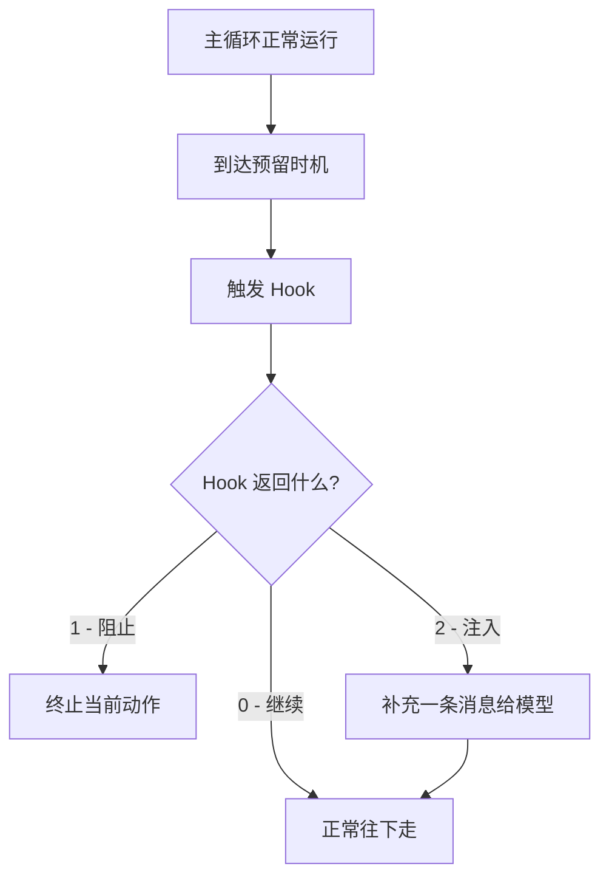

主循环只负责“通知时机”和“处理结果”，具体做什么由 Hook 决定。

### 怎么实现？

#### 定义 Hook 事件

```python
HOOK_EVENTS = ("SessionStart", "PreToolUse", "PostToolUse")
```

- **SessionStart**：会话刚开始时
- **PreToolUse**：模型要调用工具之前（可阻止）
- **PostToolUse**：工具执行完之后（可补充说明）

#### HookManager

```python
class HookManager:
    def __init__(self):
        self.hooks = {"PreToolUse": [], "PostToolUse": [], "SessionStart": []}
        # 从 .hooks.json 加载配置
        self._load_hooks()
    
    def run_hooks(self, event: str, context: dict) -> dict:
        result = {"blocked": False, "messages": []}
        
        for hook_def in self.hooks.get(event, []):
            # 执行外部命令（可以是脚本、程序等）
            r = subprocess.run(hook_def["command"], shell=True, env=env_with_context, ...)
            
            if r.returncode == 1:   # 阻止
                result["blocked"] = True
            elif r.returncode == 2: # 注入消息
                result["messages"].append(r.stderr.strip())
        
        return result
```

#### 接入主循环（关键部分）

```python
# PreToolUse
pre = hooks.run_hooks("PreToolUse", {
    "tool_name": block.name,
    "tool_input": block.input
})

if pre["blocked"]:
    results.append({"type": "tool_result", "content": "Tool blocked by hook"})
    continue

if pre["messages"]:
    # 可以把 hook 的消息注入给模型

# 执行工具
output = handler(**block.input)

# PostToolUse
post = hooks.run_hooks("PostToolUse", {
    "tool_name": block.name,
    "tool_input": block.input,
    "tool_output": output
})
```

**最核心的思想**：主循环只在固定位置调用 `run_hooks`，具体行为由外部 Hook 配置决定。

## 记忆系统（Memory）

**只保存跨会话还成立的东西。**

这一章我们给大脑增加**长期记忆**的能力：让那些跨会话仍然有价值的信息，在下次新会话开始时还能被记住。

### 为什么需要记忆系统？

如果 Agent 每次新会话都从零开始，它就会反复忘记：

- 用户长期的偏好（喜欢 tabs 还是 spaces）
- 用户多次纠正过的错误
- 项目中某些不容易从代码直接看出来的背景或约定
- 外部重要资源的指针

**Memory 的核心作用**是：让 Agent 在不同会话之间保持一定的连续性，显得“越来越懂你和这个项目”。

但先要立一个重要边界：**Memory 不是什么都存**。

### 最简单的心智模型

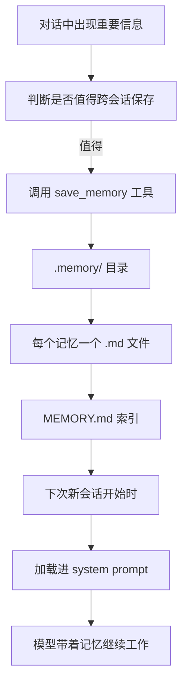

**关键原则**：只有跨会话仍有价值、且无法轻易从当前代码重新推导出来的信息，才存进 Memory。

### 怎么实现？（结合代码讲解）

#### Memory 的四种类型

```python
MEMORY_TYPES = ("user", "feedback", "project", "reference")
```

- **user**：用户偏好（代码风格、回答长度等）
- **feedback**：用户明确纠正过的地方
- **project**：项目中非显而易见的背景或约定
- **reference**：外部资源指针（看板、文档、监控地址等）

#### MemoryManager（核心管理器）

```python
class MemoryManager:
    def load_all(self):
        # 加载所有 .memory/*.md 文件
    
    def load_memory_prompt(self) -> str:
        # 把记忆拼成一段可读文本，供 system prompt 使用
        ...
    
    def save_memory(self, name, description, mem_type, content):
        # 保存为单独的 .md 文件（带 frontmatter）
        # 同时更新 MEMORY.md 索引
        ...
```

每个记忆都是一个独立 Markdown 文件，例如：

```markdown
---
name: prefer_tabs
description: User prefers tabs for indentation
type: user
---
The user explicitly prefers tabs over spaces when editing source files.
```

#### save_memory 工具

```python
TOOL_HANDLERS = {
    ...
    "save_memory": lambda **kw: memory_mgr.save_memory(
        kw["name"], kw["description"], kw["type"], kw["content"]
    )
}
```

模型可以在任何时候调用这个工具，把值得记住的信息存下来。

#### 会话开始时加载记忆

```python
def build_system_prompt():
    memory_section = memory_mgr.load_memory_prompt()
    return f"""You are a coding agent at {WORKDIR}.
{memory_section}

{MEMORY_GUIDANCE}"""
```

这样每次新会话，记忆都会自然地出现在模型的 system prompt 中。

## 系统提示词

**系统提示词不是一整块固定文本，而是一条可维护的组装流水线。**

这一章我们把模型的“输入大脑”从一大坨硬编码字符串，升级成**分段组装的流水线**。

---

### 为什么需要这一步？

如果还把 system prompt 当成一段写死的大文本，就会出现问题：

- 工具列表变了要改 prompt
- 新增 memory 要改 prompt
- 当前模式、日期、目录等动态信息也得硬塞进去
- 越来越难维护，也越来越容易出错

**这一章的核心升级是**：把 system prompt 变成一条**流水线**，不同来源的信息按顺序拼接，最后组成完整的输入。

### 怎么实现？

#### 建立 Prompt Builder

```python
class SystemPromptBuilder:
    def build(self) -> str:
        parts = []
        parts.append(self._build_core_identity())
        parts.append(self._build_tools_section())
        parts.append(self._build_skills_section())
        parts.append(self._build_memory_section())
        parts.append(self._build_claude_md_section())
        parts.append(self._build_dynamic_context())
        return "\n\n".join(p for p in parts if p.strip())
```

#### 每一段职责清晰

- `_build_core_identity()`：“你是谁、你要怎么做事”
- `_build_tools_section()`：当前可用的工具列表
- `_build_memory_section()`：加载的长期记忆
- `_build_dynamic_context()`：当前日期、工作目录、权限模式等每轮可能变化的信息

#### 在 agent_loop 中使用

```python
def agent_loop(messages: list):
    while True:
        system = prompt_builder.build() # 每轮动态组装
        
        response = client.messages.create(
            model=MODEL,
            system=system,  # 使用组装后的 prompt
            messages=messages,
            tools=TOOLS,
        )
        ...
```

这样我们既保持了 system prompt 的稳定，又能灵活注入动态内容。

## 错误恢复

**错误不是例外，而是主循环必须预留出来的一条正常分支。**

这一节我们给系统增加**错误恢复**能力：当出问题时，不是直接崩溃，而是先判断类型、再尝试续下去。

### 为什么需要这一步？

真实运行中总会遇到各种问题：

- 模型输出被 token 限制截断
- 上下文太长，请求直接失败
- 网络抖动、API 超时、限流

如果没有恢复机制，主循环一出错就停掉，用户体验会非常差。

**这一节的核心目标是**：把“报错就崩”升级成“先分类错误，再选择恢复路径”，让 Agent 变得更健壮。


### 最简单的心智模型

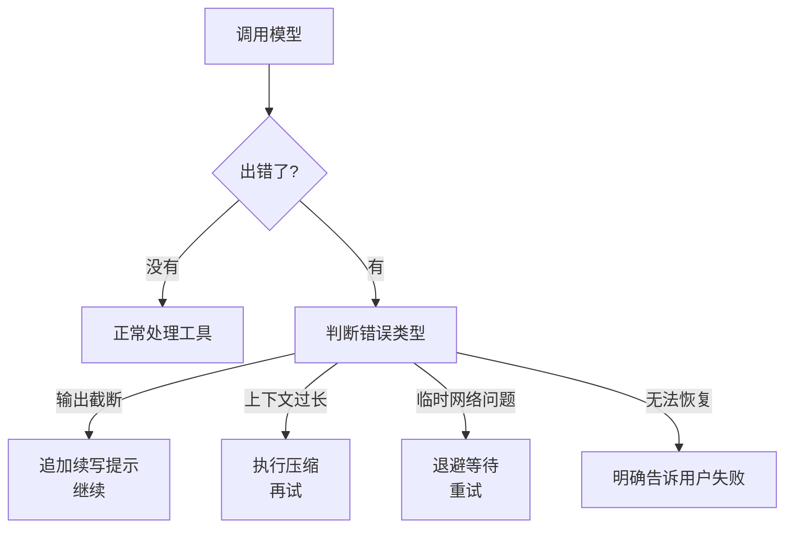

**关键思想**：错误发生后，先分类，再恢复，最后才认输。

### 怎么实现？

#### 错误分类与恢复决策

```python
def choose_recovery(stop_reason: str = None, error_text: str = None) -> dict:
    if stop_reason == "max_tokens":
        return {"kind": "continue", "reason": "输出被截断，需要续写"}
    
    if error_text and "prompt is too long" in error_text.lower():
        return {"kind": "compact", "reason": "上下文过长，需要压缩"}
    
    if error_text and any(word in error_text.lower() for word in ["timeout", "rate limit", "connection", "unavailable"]):
        return {"kind": "backoff", "reason": "临时网络问题"}
    
    return {"kind": "fail", "reason": "无法恢复的错误"}
```

#### 给每种恢复路径加上预算保护

```python
recovery_state = {
    "continuation_attempts": 0,
    "compact_attempts": 0,
    "backoff_attempts": 0,
}
```

#### 接入主循环

```python
while True:
    try:
        response = client.messages.create(...)
        
        if response.stop_reason == "max_tokens":
            if state["continuation_attempts"] >= 3:
                break   # 超出预算
            state["continuation_attempts"] += 1
            messages.append({"role": "user", "content": CONTINUE_MESSAGE})
            continue
            
    except Exception as e:
        decision = choose_recovery(None, str(e))
        
        if decision["kind"] == "backoff":
            if state["backoff_attempts"] >= 3:
                break
            time.sleep(backoff_delay(state["backoff_attempts"]))
            state["backoff_attempts"] += 1
            continue
        else:
            break   # 其他错误直接失败
```

**续写提示**（非常重要）：

```python
CONTINUE_MESSAGE = "Output was cut off. Continue directly from where you stopped. Do not repeat previous content."
```

## 任务系统（持久化工作图）

**Todo 适合会话内规划，持久任务图才负责跨步骤、跨阶段协调工作。**

这一章我们把“当前会话的待办清单”升级成**可持久化的任务图**，让复杂工作能跨会话、跨步骤、甚至跨多个 Agent 协同推进。

### 为什么需要这一步？

Todo 已经能帮 Agent 把大目标拆成几步，但它仍然存在明显限制：

- 只活在当前会话里，上下文压缩后容易丢失
- 不擅长表达“谁依赖谁、前置条件是什么”
- 多个 Agent 协作时，没有统一的工作板

例如下面这种工作：

- 先写解析器 -> 再写语义检查 -> 测试和文档可以并行 -> 最后整体验收

这已经不是简单列表，而是一张**带依赖关系的工作图**。

**这一章的核心升级是**：引入持久化的 Task 系统，让工作目标能真正“活”在磁盘上，并且能自动处理依赖解锁。

### 最简单的心智模型

```mermaid
flowchart TD
    A[用户提出复杂目标] --> B[模型拆成任务]
    B --> C[.tasks/ 目录]
    C --> D[Task 1] --> E[Task 2 blockedBy: [1]]
    E --> F[Task 3 blockedBy: [2]]
    D -->|完成| G[自动解锁后续任务]
    G --> H[模型看到新的 ready 任务]
```

任务不再只是“清单”，而是**带状态和依赖关系的工作图**。

### 怎么实现？

#### 任务存储结构（TaskRecord）

每个任务保存为 `.tasks/task_xxx.json`：

```python
task = {
    "id": 1,
    "subject": "Write parser",
    "description": "...",
    "status": "pending",        # pending / in_progress / completed
    "blockedBy": [2, 3],        # 还在等谁
    "blocks": [5],              # 完成后会解锁谁
    "owner": ""                 # 谁在负责
}
```

#### TaskManager（核心管理器）

```python
class TaskManager:
    def create(self, subject: str, description: str = "") -> str:
        # 创建新任务并保存为 JSON
    
    def update(self, task_id: int, status=None, owner=None, addBlockedBy=None, addBlocks=None):
        # 更新状态、设置依赖
        if status == "completed":
            self._clear_dependency(task_id)   # 自动解锁后续任务
    
    def list_all(self) -> str:
        # 返回可读的任务板
```

#### 工具接入主循环

```python
TOOL_HANDLERS = {
    "task_create": lambda **kw: TASKS.create(kw["subject"], kw.get("description", "")),
    "task_update": lambda **kw: TASKS.update(...),
    "task_list":   lambda **kw: TASKS.list_all(),
    "task_get":    lambda **kw: TASKS.get(kw["task_id"]),
}
```

模型可以随时调用这些工具来创建、更新、查看任务，而主循环完全不需要改动。

## 后台任务

**慢命令可以在旁边等，主循环不必陪着发呆。**

这一章我们把**任务目标**和**实际运行槽位**分开，让慢操作跑到后台，主循环继续向前推进。

### 为什么需要这一步？

前面章节的工具调用都是同步的：

模型发起 -> 立刻执行 -> 立刻返回结果

这对短命令没问题，但遇到下面这些情况就会卡住：

- `npm install`
- `pytest` 全量测试
- `docker build`
- 大型代码生成或静态检查

如果主循环一直傻等，用户和模型都会被堵住。

**这一章的核心升级是**：把慢执行移到后台，让主循环继续做别的事情，结果通过通知稍后带回。

### 最简单的心智模型

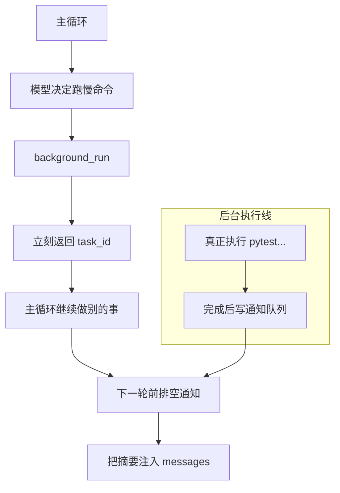

**关键点**：主循环仍然只有一条，并行的是“等待”而不是主循环本身。

### 怎么实现？

#### 后台任务记录（RuntimeTaskRecord）

```python
runtime_task = {
    "id": "a1b2c3d4",
    "command": "pytest -q",
    "status": "running",          # running / completed / failed / timeout
    "started_at": 1710000000.0,
    "result_preview": "12 passed...",
    "output_file": ".runtime-tasks/a1b2c3d4.log"
}
```

- JSON 文件记录运行状态
- .log 文件保存完整输出

#### BackgroundManager（核心管理器）

```python
class BackgroundManager:
    def __init__(self):
        self.tasks = {}           # 当前运行中的任务
        self.notifications = []   # 完成后的通知
        self.lock = threading.Lock()
    
    def run(self, command: str) -> str:
        task_id = generate_id()
        self.tasks[task_id] = {"id": task_id, "command": command, "status": "running"}
        
        # 启动后台线程
        thread = threading.Thread(
            target=self._execute,
            args=(task_id, command),
            daemon=True
        )
        thread.start()
        
        return f"Background task started: {task_id}"
```

#### 后台真正执行 + 写通知

```python
def _execute(self, task_id: str, command: str):
    try:
        result = subprocess.run(command, shell=True, cwd=WORKDIR, 
                              capture_output=True, text=True, timeout=600)
        preview = (result.stdout + result.stderr)[:800]
        status = "completed"
    except Exception as e:
        preview = str(e)[:500]
        status = "failed"
    
    with self.lock:
        self.notifications.append({
            "type": "background_completed",
            "task_id": task_id,
            "status": status,
            "preview": preview
        })
```

#### 主循环前排空通知

```python
def before_model_call(messages):
    notifs = bg.drain_notifications()
    if notifs:
        text = "\n".join(f"[Background {n['task_id']}] {n['status']}: {n['preview']}" 
                        for n in notifs)
        messages.append({"role": "user", "content": text})
```

## 定时调度

**当任务能后台运行以后，时间本身也会变成另一种启动入口。**

这一章我们给系统增加**定时触发**能力：让 Agent 不只响应当前指令，还能安排未来某个时间自动开始工作。

### 为什么需要这一步？

上一节已经让慢命令可以跑到后台，但后台任务默认是“现在就启动”。

现实中很多工作并不是立刻要做，而是要**在未来某个时间点**执行：

- 每天晚上跑一次全量测试
- 每周一早上生成周报
- 30 分钟后提醒我继续检查某个 PR

如果没有调度机制，用户就只能每次手动再说一遍，系统显得“只能当下响应”，而不是“能主动安排未来”。

**这一节的核心升级是**：把一条未来要执行的意图先记下来，等时间到了再自动触发，回到主循环。

### 最简单的心智模型

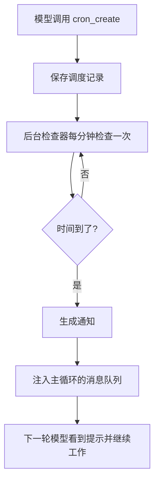

**关键点**：调度器只负责“记住未来何时开始”，真正做事时仍然回到同一条主循环。

### 怎么实现？

#### 调度记录（ScheduleRecord）

```python
schedule = {
    "id": "job_001",
    "cron": "0 9 * * 1",    # 每周一早上 9 点
    "prompt": "Run the weekly status report",
    "recurring": True,  # 是否重复
    "durable": True,    # 是否落盘
    "created_at": 1710000000.0,
    "last_fired_at": None
}
```

#### CronScheduler（核心调度器）

```python
class CronScheduler:
    def create(self, cron_expr: str, prompt: str, recurring=True, durable=False):
        # 创建并保存调度记录
    
    def start(self):
        # 启动后台检查线程
        self._thread = threading.Thread(target=self._check_loop, daemon=True)
        self._thread.start()
    
    def _check_loop(self):
        while True:
            now = datetime.now()
            self._check_tasks(now)
            time.sleep(60)   # 每分钟检查一次
```

#### 时间到了就发通知

```python
def _check_tasks(self, now):
    for task in self.tasks:
        if cron_matches(task["cron"], now):
            self.queue.put(f"[Scheduled {task['id']}] {task['prompt']}")
            task["last_fired_at"] = time.time()
```

#### 主循环前排空定时通知

```python
notifications = scheduler.drain_notifications()
for note in notifications:
    messages.append({"role": "user", "content": note})
```

这样定时任务最终还是通过普通 user message 的形式回到模型手里。